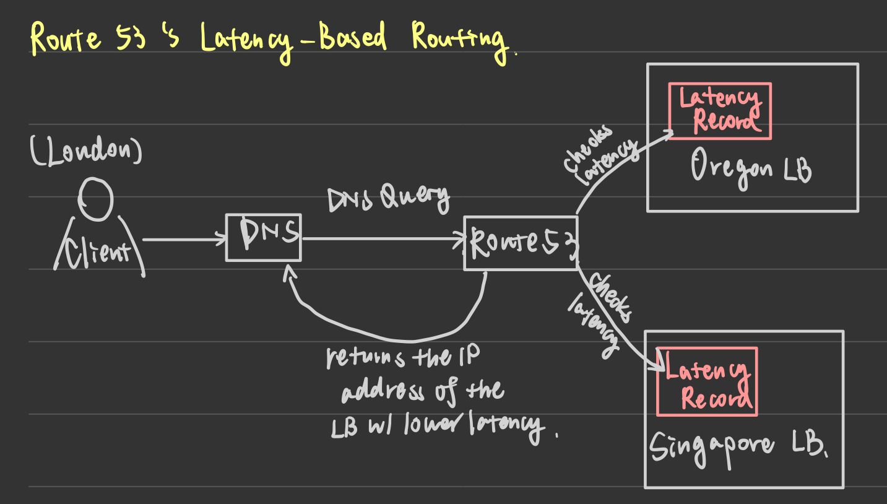

# DNS (Domain Name System)
- **Purpose:** Translates domain names (e.g., `www.example.com`) to IP addresses.
- **Hierarchy:** Operates through a hierarchical system of authoritative servers at top levels.
## DNS Lookup Process
- **Resolver:** Your router or ISP typically provides the DNS server(s) to contact.
	- **Router:**
		- A **router** is a networking device that directs data packets between different computer networks.
			- **Data Packet:**
				- A unit of data formatted for transmission over a network. 
				- When information (e.g., a file, email, or web request) is sent from one device to another, it is broken up into smaller chunks called **packets**.
				- Each packet typically contains:
					- Header Information:
						- Source and destination addresses (e.g., `IP addresses`)
						- Other control info (e.g., `TTL`)
					- Payload: 
						- The actual data being sent (e.g., part of the file, message)
						  
		- In home or small office setups, a router often connects the local network (e.g., all devices in your house) to the wider internet. It does this by:
			- **Translating** local network traffic into an Internet-readable format (via Network Address Translation, or NAT).
			- **Routing** packets to their correct destination (either inside your network or out on the Internet).
			- **Managing** devices on the local network (often including Wi-Fi, IP address assignment via DHCP)
	- **ISP (Internet Service Provider)**
		-  An ISP is a company or organization that offers services for accessing and using the Internet. 
		- They handle the infrastructure needed to connect your home or business to the global Internet.
		- E.g.,
			- Cable or DSL providers
			- Fiber optic providers
			- Mobile data providers
- **Caching:** 
	- Lower-level DNS servers cache mappings (risk of stale entries during propagation delays.)
	- Browsers and operating systems also cache DNS results for a time (determined by TTL).
		- **TTL (Time to Live)**:
			- **General Concept (Networking):**
				- In IP address, TTL is a value in the packet header that specifies how many network hops (routers) a packet can pass before it's discarded.
				- This prevents routing loops from causing packets to circle forever.
			- **DNS Context:** 
				- In DNS, TTL is the amount of time (in seconds) that a DNS record is cached by clients and DNS resolvers before they must re-query the authoritative DNS server.
				- A higher TTL means the record stays in caches longer (fewer lookups, less bandwidth), while a lower TTL allows for more frequent updates but increases the number of lookups.
## Common DNS Records
- **NS (Name Server):** Specifies the DNS servers for a domain or subdomain.
- **MX (Mail Exchange):** Specifies mail servers responsible for receiving email.
- **A (Address):** Maps a domain name to an IPv4 address.
- **CNAME (Canonical Name):** Points a name to another name or `CNAME` (`example.com` -> `www.example.com`) or to an `A` record.
## Managed DNS Services
- Examples: `Cloudflare`, `Amazon Route 53`
- Routing Methods: 
	- Weighted round robin
		- Prevent traffic from going to servers under maintenance
	- Load balancing & failover (e.g., for maintenance or varying cluster sizes)
	- A/B testing 
	- Latency-based routing
		- 
	- Geolocation-based routing 
## Disadvantages: DNS
- **DNS Lookup Delay:** Slight overhead is introduced when querying a DNS server (though caching mitigates this).
- **Management Complexity:** DNS is generally managed by governments, ISPs, or large companies.
- **Security and DDoS Attacks:**
	- DNS servers are frequent targets for DDoS attacks.
		- **DDoS (Distributed Denial of Service) Attach:**
			- DDoS attack is a type of cyberattack aimed at making a website, server, or network service unavailable to its intended users. 
	- Attacks can disrupt DNS resolution, making websites inaccessible unless users know their IP addresses.
# CDN (Content Delivery Network)
- A CDN is a geographically distributed network of **proxy servers** that delivers content to users based on their location.
	- Proxy
		- A proxy is an intermediary server that sits between a client (e.g., a web browser) and a destination server (e.g., a website or an application server).
		- It forwards **requests and responses** between the client and the destination, ofter providing added functionality like **security, anonymity, caching, or content filtering**. 
		- **Forward Proxy:**
			- Sits between **the client and the internet**.
			- Used to **hide the client's identity**, enforce policies, or improve performance.
			- Forward proxies **act on behalf of users** and send requests to **any websites**.
			- Common Use Cases: 
				- **Anonymity:** Users can browse anonymously by hiding their IP addresses.
				- **Access Control:** Companies use forward proxies to **block access** to certain websites. 
				- **Caching:** Proxies store frequently accessed resources to **reduce bandwidth usage** and improve speed.
			- Example:
				- A corporate network using a proxy to **filter and monitor** employees' internet usage.
		- **Reverse Proxy:** 
			- Sits **between the internet and the backend servers**.
			- **Handles requests on behalf of servers**, often for load balancing and security.
			- **Common Use Cases:**
				- **Load Balancing:** 
					- Distributes traffic across multiple servers to prevent overload.
				- **Security:**
					- Protects backend servers from direct exposure to the internet.
				- **SSL Termination:**
					- Offloads SSL encryption to improve server performance.
			- Example (reverse proxies to protect web apps):
				- Cloudflare
				- Nginx
				- Apache
		- **Transparent Proxy**
			- Intercepts client requests **without modifying them or notifying the user**.
			- Often used for **content filtering or caching** in corporate networks or ISPs.
			- Example: 
				- Schools or companies **blocking** certain websites without users knowing. 
		- **Anonymous Proxy**
			- **Hides the user's IP address** from the destination server.
			- Used for **privacy and bypassing geo-restrictions**.
			- Example:
				-  VPN services or web proxies like **Tor, HideMyAss, or ProtonVPN**.
			- Can I use an anonymous proxy to bypass a transparent proxy?
				- Yes, in some cases.
					- If the transparent proxy is filtering traffic, an anonymous proxy (or VPN) can encrypt my connection, preventing the transparent proxy from seeing what website I'm visiting.
					- However, some networks block known proxy IPs.
					- If the transparent proxy only block certain sites, a VPN or anonymous proxy can help bypass it. 
					- If the transparent proxy blocks all unknown connecitons, a VPN might not work.
		- **High Anonymity Proxy (Elite Proxy)**
			- Full **disguises** itself as a normal user, making it difficult to detect as a proxy.
			- Used by **security professionals, journalists, and individuals in restricted regions**.
			- When using an anonymous proxy, the websites know a proxy is used. But when using a high anonymity proxy, websites cannot detect a proxy.
		- SOCKS Proxy
			- A **lower-level proxy** that can handle various types of traffic (HTTP, FTP, SMTP, etc.).
			- More flexible but **slower than HTTP Proxies**.
				- An HTTP Proxy only forwards HTTP requests.
			- Example:
				- **SOCKS5** for secure torrenting or bypassing censorship.
- CDN improves performance and availability by reducing latency and offloading traffic from the origin server. 
- Common use cases:
	- Delivering static files (HTML, CSS, JS, images, videos), dynamic content, live and on-demand streaming, security services (DDoS protection, web application firewalls), and load balancing.
- Examples of CDN providers:
	- Akamai
	- Cloudflare
	- Amazon CloudFront
	- Fastly
	- Google Cloud CDN
## Why use CDN?
### Performance Benefits 
- Lower Latency
	- Users receive content from servers closer to their location.
- Reduced Server Load 
	- Origin servers do not have to handle every request, improving scalability.
- Faster Load Times
	- Content caching minimizes delays.
### Scalability and Reliability
- Handles Traffic Surges
	- Protects websites from crashes due to flash crowds (sudden high traffic).
	- **Flash Crowd**
		- A flash crowd happens when sudden high traffic spikes overwhelm a server.
		- Example: 
			- A Super Bowl ad goes viral -> Millions of users rush to the website -> Server crashes.
- Fault Tolerance
	- Content can be served from alternate CDN node if one fails.
### Cost Efficiency
- Reduces Bandwidth Usage
	- Bandwidth
		- **Bandwidth** refers to the **maximum amount of data that can be transmitted over a network** in a given period.
		- It is usually measured in **bits per second (bps)**, such as:
			- Kilobits per second (Kbps)
			- Megabits per second (Mbps)
			- Gigabits per second (Gbps)
		- **Bandwidth Usage** 
			- Bandwidth Usage refers to the **actual amount of data transferred over a network** during a specific period.
			- It is measured in megabytes (MB), gigabytes (GB), or terabytes (TB).
	- Caching minimizes requests to the origin server, reducing hosting costs.
- Optimized Content Delivery
	- Images, videos and other media are optimized dynamically.
### Security Features
- DDoS Protection
	- Absorbs malicious traffic before it reaches the origin.
- Web Application Firewalls (WAD)
	- Filters out malicious requests
- SSL/TLS Encryption
	- SSL (Secure Sockets Layer) and TLS (Transport Layer Security) are cryptographic protocols that **encrypt data** transferred between a user's browser and a website.
		- TLS is the successor to SSL. 
			- TLS is more secure and used by most modern websites.
		- How it works: 
			- When a user visits a website with **HTTPS**, the browser and the server establish a **secure encrypted connection** using TLS.
			- This prevents **hackers from intercepting** sensitive data (like passwords, credit card numbers).
		- Example: 
			- When you log in to **online banking**, TLS ensures your credential **cannot be stolen** by a third party.
	- Ensures secure data transmission.
## Push vs. Pull CDNs
- CDNs operate in two primary modes: **Push CDN** and **Pull CDN**.
### Push CDN
- How it works: 
	- The content owner uploads files to the CDN before they are requested by users.
- Best for:
	 - Websites with static content that doesn't change frequently.
	 - Sites with low to moderate traffic.
	 - Scenarios where complete control over content freshness is required.
 - Disadvantages:
	- Requires **manual updates** when content changes.
	- Increased **server load** when pushing updates.
### Pull CDN
- How it works: 
	- The CDN fetches content from the origin server only when users request it.
- Best for: 
	- Websites with **high traffic and dynamic content**.
	- Sites where content changes often.
- Disadvantages:
	- First request is slower since content is fetched from the origin.
	- Potentially stale content if caching rules are not properly configures.
### Akamai's CDN Approach (Case Study)
- Akamai is a leader in CDN technology, with **over 12,000** servers in **1,000+ networks**.
- Solves **flash crowd problems** by distributing content across multiple locations.
- Uses **DNS-based request routing** to direct users to the **nearest and least loaded server**.
	- 
- Key technical innovations:
	- Dynamic load balancing
		- Redirects traffic based on **real-time network conditions**.
	- Edge Side Includes (ESI)
		- Allows **partial page caching** for **dynamic content**.
		- **Partial Page Caching**
			- Partial Page Caching stores **static portions** of a webpage while allowing dynamic elements to update in real-time.
			- Example:
				- A news site caches the header, footer, and sidebar, but keeps the main article body dynamic.
	- Real-time monitoring
		- Detects failures and redirects requests accordingly.
	- Security features
		- Protects against DDoS attacks, authentication issues, and content integrity failures.
### CDN Implementation Considerations 
#### Load Balancing & Request Routing 
- CDN systems decide which server to route traffic to based on:
	- User's geographic location.
	- Server load (CPU, bandwidth).
	- Network conditions (latency, packet loss).
	- Content availability (cached vs. non-cached).
#### Caching Strategies 
- Time-to-Live (TTL)
	- Determines how long content is cached before checking for updates.
- Cache Invalidation
	- Ensures updated content is served when necessary.
- Edge Side Includes (ESI)
	- Allows dynamic content assembly at the edge.
#### Security & Privacy Challenges
- GDPR Compliance
	- Some CDNs transmit user data (IP addresses), raising privacy concerns.
- Malicious Content Injection
	- CDNs must guard agains JavaScript-based attacks.
- DDoS Protection
	- CDNs help mitigate attacks by absorbing traffic before it reaches the origin
#### Cost Considerations 
- CDNs charge based on
	- Data transfer (GB/month).
	- Number of requests.
	- Geographic distribution of traffic.
- Free CDN options exist (Cloudflare Free Plan), but may have limitations.
## CDN Trends and Advanced Technologies
### Peer-to-Peer (P2P) CDNs
- Users act as **both clients and servers**, distributing content among themselves.
- Example
	- BitTorrent-based CDNs
### Telco CDNs
- Telecom companies (e.g., Verizon, AT&T) deploy CDNs within their networks to optimize video streaming and reduce infrastructure costs.
### Virtual CDNs (vCDNs)
- CDN nodes are **deployed dynamically** as virtual machines or containers.
- Increases elasticity and reduces cost.
### Federated CDNs
- Multiple CDN providers interconnect, allowing content to be delivered efficiently across different networks.
- Example
	- Operator Carrier Exchange (OCX).
### Image Optimization CDNs 
- Some CDNs automatically optimize images for device type, resolution, and network speed. 
- Examples 
	- Cloudinary 
	- Imgix
## CDN Use Cases 
- E-commerce Sites (Amazon, Shopify)
	- Faster product page loading.
- Streaming Services (Netflix, YouTube)
	- Video buffering reduction.
- News & Media Portals (CNN, BBC)
	- High availability during traffic spikes.
- Gaming Platforms (Steam, PlayStation Network)
	- Faster game downloads.
	